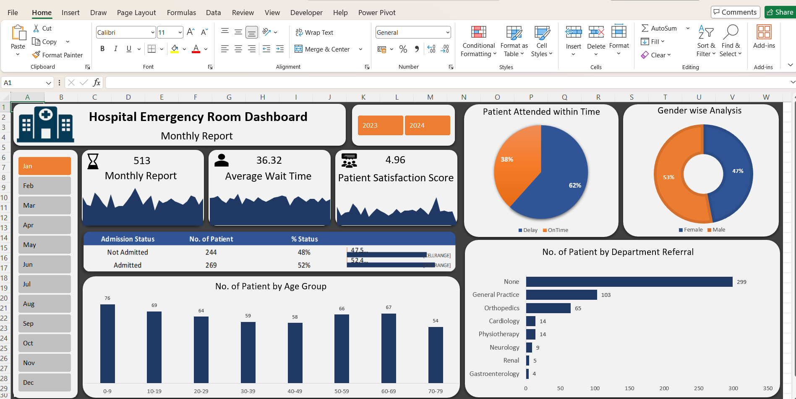
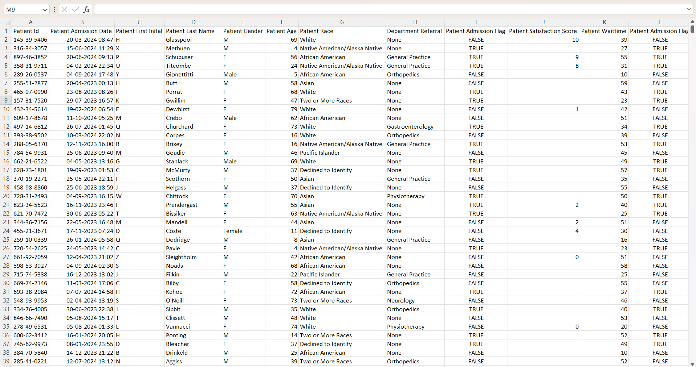

# 🏥 Hospital Emergency Room Dashboard

An interactive Excel dashboard created to analyze hospital emergency room patient data and operational performance.

## 📊 Dashboard Preview

## Project Overview

This project presents an interactive Hospital Emergency Room Dashboard developed using Microsoft Excel.

The dashboard provides a monthly view of emergency room activity and helps analyze patient volume, waiting time, satisfaction score, admission status, patient attendance, gender distribution, age groups, and department referrals.

The objective of this project is to transform raw patient data into meaningful visual insights that can help understand emergency room operations and patient trends.

## From Data to Dashboard

The project started with hospital emergency room patient data containing information related to patient visits, demographics, admission status, waiting time, satisfaction, attendance, and department referrals.

The data was analyzed and transformed using Excel to create KPIs, charts, and interactive dashboard elements.

The dashboard includes monthly and yearly filters to make the analysis more interactive.

### Source Data

The source dataset was cleaned and prepared before creating the dashboard.

***Key fields used for analysis include:***

- Patient information
- Admission status
- Patient age
- Gender
- Waiting time
- Patient satisfaction score
- Attendance status
- Department referral
- Visit date/month

## Dashboard Features

- Total / Monthly Patient Count
- Average Wait Time
- Patient Satisfaction Score
- Patient Attended Within Time
- Admission Status Analysis
- Gender-wise Analysis
- Patient Distribution by Age Group
- Patient Count by Department Referral
- Monthly analysis from January to December
- Year-based filtering
- Interactive Excel dashboard
- KPI cards and data visualizations

## Key Insights

***The dashboard helps analyze:***

- Overall emergency room patient volume
- Patient attendance and waiting-time patterns
- Admitted vs. non-admitted patients
- Gender distribution of patients
- Patient distribution across different age groups
- Department referral patterns
- Patient satisfaction performance
- Monthly changes in emergency room activity

## Files Included

| File | Description |
|---|---|
| `excel-dashboard.xlsx` | Interactive Excel dashboard |
| `dashboard-image.png` | Dashboard preview image |
| `data.png` | Source dataset preview |
| `README.md` | Project documentation |

## How to Download and Use

1. Download `excel-dashboard.xlsx`.
2. Open the file using Microsoft Excel.
3. Go to the Dashboard worksheet.
4. Use the month and year filters to explore the dashboard.
5. Interact with the charts and KPIs to analyze the emergency room data.

[Download the Excel Dashboard](excel-dashboard.xlsx)

## Tools and Skills

- Microsoft Excel
- Data Cleaning
- Data Analysis
- Excel Formulas
- PivotTables
- PivotCharts
- Interactive Dashboard
- KPI Development
- Data Visualization
- Dashboard Design

## Project Objective

The main objective of this project is to demonstrate how Excel can be used to transform healthcare-related data into an interactive dashboard and generate meaningful business insights through data visualization.

## Author

**Unnati Lohakare**

Aspiring Data Analyst | Excel | SQL | Power BI | Python
